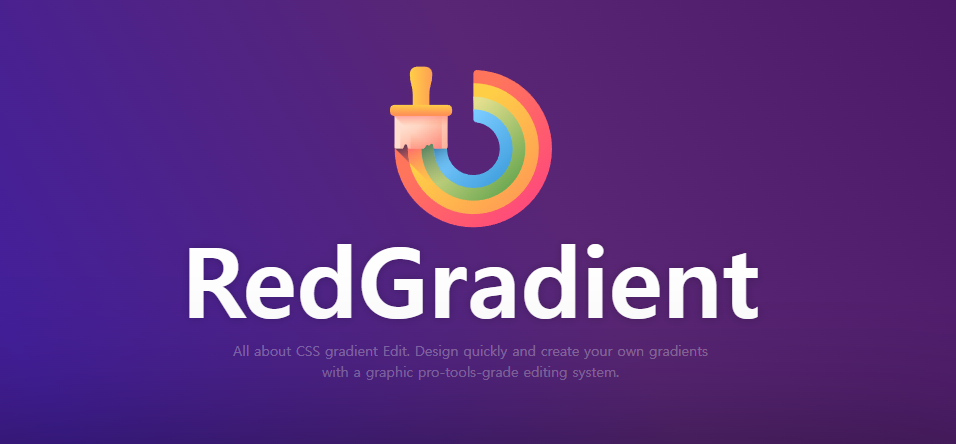

# RedGradient
```
All about CSS gradients.
Design quickly and create your own gradients with a graphic pro-tools-grade editing system.
```



## Document
- https://doc.red-gradient.com/

## Version List
- Version 1.1.0 - https://red-gradient.com/build/
- Beta Version - https://red-gradient.com/beta_version/
[](LICENSE)

## Release Note
- [V1.1.0](https://github.com/redcamel/RedGradient/releases/tag/v1.1.0)
